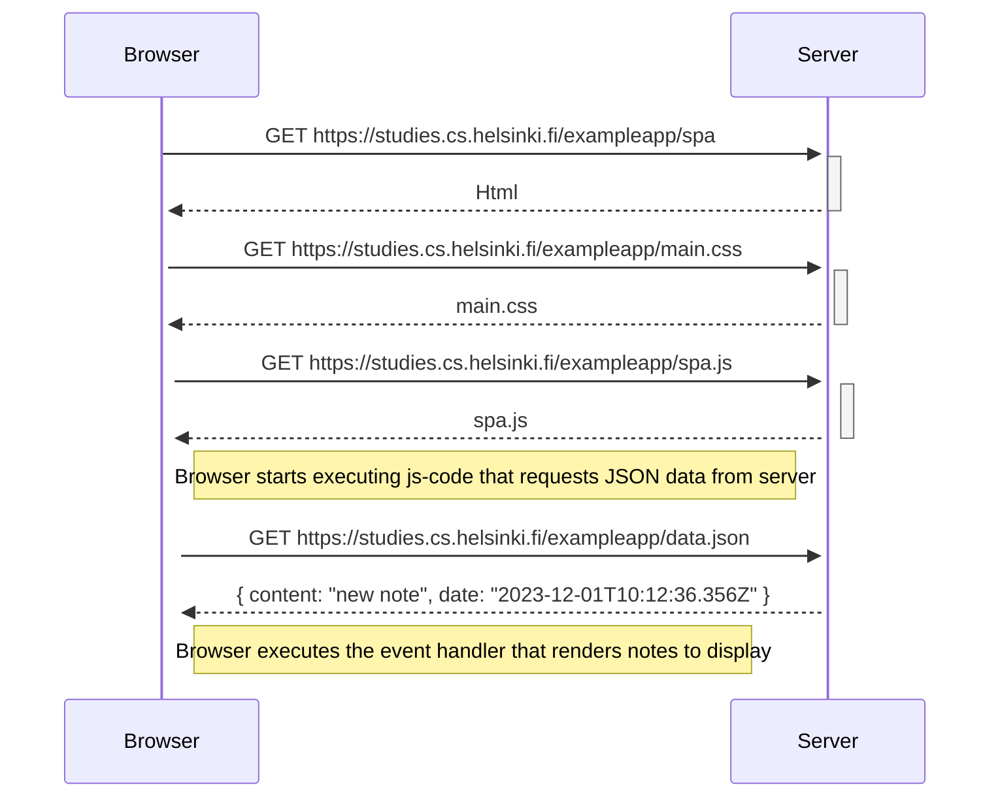

```mermaid
sequenceDiagram
    Browser->>+Server: GET https://studies.cs.helsinki.fi/exampleapp/spa
    activate Server
    Server-->>+Browser: Html
    deactivate Server

    Browser->>+Server: GET https://studies.cs.helsinki.fi/exampleapp/main.css
    activate Server
    Server-->>+Browser: main.css
    deactivate Server

    Browser->>+Server: GET https://studies.cs.helsinki.fi/exampleapp/spa.js
    activate Server
    Server-->>+Browser: spa.js
    deactivate Server

    Note right of Browser: Browser starts executing js-code that requests JSON data from server

    Browser->>+Server: GET https://studies.cs.helsinki.fi/exampleapp/data.json
    activate Server
    Server-->>+Browser: { content: "new note", date: "2023-12-01T10:12:36.356Z" }

    Note right of Browser: Browser executes the event handler that renders notes to display
```
