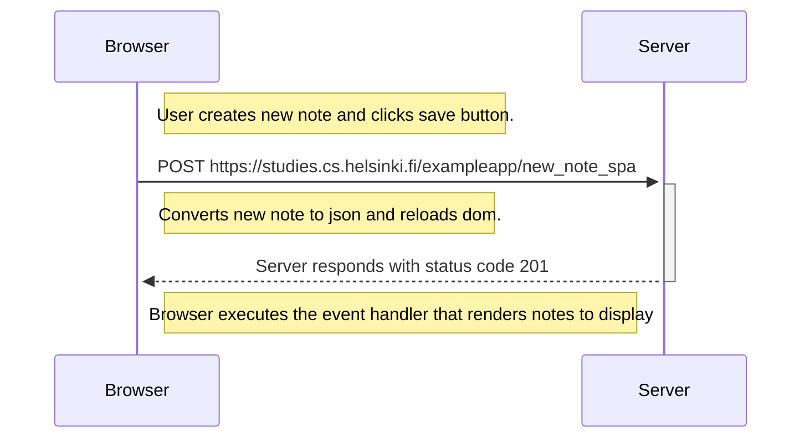

```mermaid
sequenceDiagram
    Note right of Browser: User creates new note and clicks save button.

    Browser->>+Server: POST https://studies.cs.helsinki.fi/exampleapp/new_note_spa
    activate Server
    Note right of Browser: Converts new note to json and reloads dom.
    Server-->>+Browser: Server responds with status code 201
    deactivate Server
    Note right of Browser: Browser executes the event handler that renders notes to display
```
