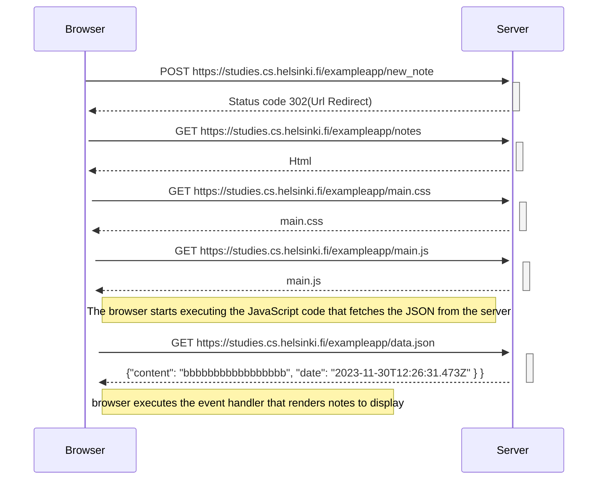

```mermaid
sequenceDiagram
    Browser->>+Server: POST https://studies.cs.helsinki.fi/exampleapp/new_note
    activate Server
    Server-->>+Browser: Status code 302(Url Redirect)
    deactivate Server

    Browser->>+Server: GET https://studies.cs.helsinki.fi/exampleapp/notes
    activate Server
    Server-->>+Browser: Html
    deactivate Server

    Browser->>+Server: GET https://studies.cs.helsinki.fi/exampleapp/main.css
    activate Server
    Server-->>+Browser: main.css
    deactivate Server

    Browser->>+Server: GET https://studies.cs.helsinki.fi/exampleapp/main.js
    activate Server
    Server-->>+Browser: main.js
    deactivate Server
    Note right of Browser: The browser starts executing the JavaScript code that fetches the JSON from the server

    Browser->>+Server: GET https://studies.cs.helsinki.fi/exampleapp/data.json
    activate Server
    Server-->>+Browser: {"content": "bbbbbbbbbbbbbbbbb",   "date": "2023-11-30T12:26:31.473Z"  } }
    deactivate Server

    Note right of Browser: browser executes the event handler that renders notes to display
```
